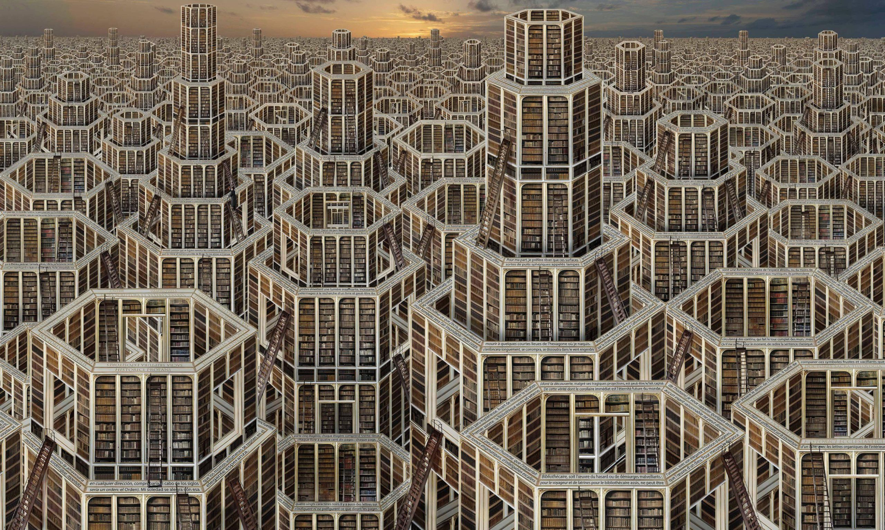

# BabelSim

A web-based simulation of the "Library of Babel" room layout, exploring the properties of random walks and loops on a hexagonal grid with periodic boundary conditions.


## Overview

The **Library of Babel**, as conceptualized by Jorge Luis Borges, is a vast universe of hexagonal rooms. Each room connects to four others (via hallways) and has two walls with bookshelves. In this simulation, we explore a 2D projection of this structure where each hexagonal cell has exactly **two** open doorways connecting it to neighbors, forming a collection of continuous loops or paths.

### The Algorithm

The core of the simulation uses a **Monte Carlo** approach to generate and modify the graph of room connections:

1.  **Grid Representation**: The world is a 2D grid of hexagonal cells. We use "Odd-Q" offset coordinates for storage.
2.  **Periodic Boundaries**: The grid wraps around toroidally (top connects to bottom, left connects to right), creating an infinite, seamless surface.
3.  **Constraint**: Every cell must have exactly **degree 2** (two connected neighbors).
4.  **Scrambling (MCMC)**: To explore the configuration space, we perform random "swaps" or "scrambles":
    *   Select two pairs of connected cells, $(u, v)$ and $(x, y)$.
    *   Remove the connections $u-v$ and $x-y$.
    *   Reconnect them as $u-x$ and $v-y$ (or $u-y$ and $v-x$).
    *   This operation preserves the degree-2 constraint for all cells while altering the global loop structure.

The simulation visualizes these loops and allows users to "scramble" the connections to see how the loops merge, split, and evolve over time.

### Performance Optimization

The simulation backend is written in Python (Flask) and optimized for performance:
-   **NumPy Array Backend**: The grid state is stored in packed bit-flags within NumPy arrays for memory efficiency.
-   **Numba JIT**: The critical loop-finding algorithm is compiled to machine code using Numba, achieving real-time performance (~24+ FPS) even for large grids (N=150, 22,500 cells).

## Visuals


*Conceptual illustration of the Library of Babel's hexagonal galleries.*

## Running the Simulation

1.  Install dependencies:
    ```bash
    pip install -r requirements.txt
    ```
2.  Run the Flask app:
    ```bash
    python app.py
    ```
3.  Open `http://localhost:3000` in your browser.
